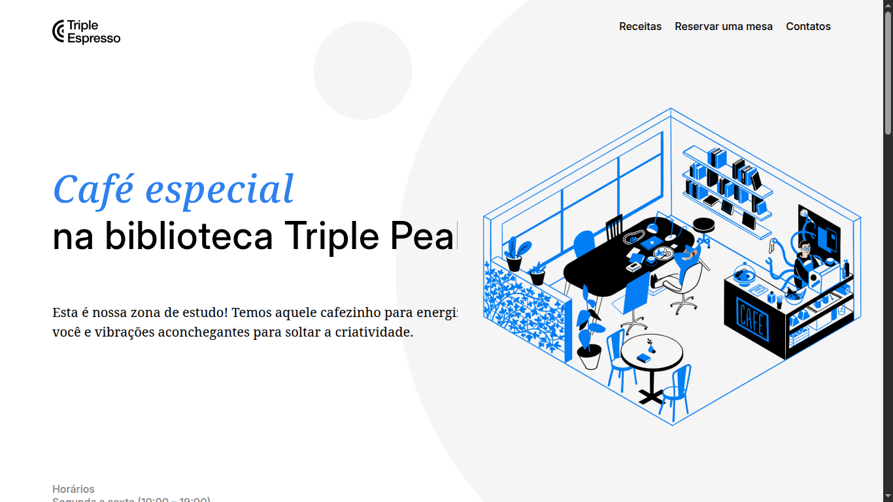

# Triple Espresso

## Projeto: HTML e CSS Avançados

Um projeto prático desenvolvido no bootcamp, com o objetivo de aplicar conceitos modernos de **HTML5** e **CSS3**, seguindo as melhores práticas do desenvolvimento web.

## Tecnologias Utilizadas

- **HTML5**:Construção semântica e acessível, utilizando a metodologia **BEM** para estruturar classes que facilitam a organização e expansão do código.
- **CSS3**:Código CSS estruturado com BEM, adotando uma abordagem **plana** para garantir clareza e manutenção simplificada.

## Principais Recursos Aprendidos

Durante o desenvolvimento deste projeto, diversos conceitos avançados foram aplicados, incluindo:

- **Pseudoclasses e pseudoelementos** para estilização avançada (por exemplo, `:hover`, `:focus`, `[type]`).
- **Incorporação de iframes** e sua responsividade.
- **Formulários**:
- Campos de entrada com restrições de valor (máximo e mínimo).
- Campos com sintaxes diferentes, incluindo rótulos.
- **Caixas de seleção e botões de opção**.
- Definição de **campos obrigatórios**.
- **Metodologia BEM**: Organização do código para garantir escalabilidade e fácil manutenção com uma estrutura **plana**.

## Desafios Enfrentados

Durante o desenvolvimento, diversos desafios surgiram, mas lições importantes foram aprendidas que ajudarão a aprimorar versões futuras:

- **Estilização de caixas de seleção**: Personalizar caixas de seleção se mostrou desafiador devido às limitações nos estilos padrão aplicados pelos navegadores, mas foi uma oportunidade de aplicar novas abordagens.
- **Implementação de formulários complexos**: Criar formulários com diferentes tipos de entrada e validações exigiu atenção especial para garantir uma experiência do usuário fluida e funcional.

## Melhorias Planejadas

Criação de um sistema de estilos **global**, feedback visual inteligente em formulários, e layout fluido com media **queries**, garantindo uma experiência moderna e acessível.

## Objetivo do Projeto

Com foco em boas práticas de desenvolvimento web, o projeto trabalha **HTML**, **CSS**, estruturação com **BEM**, além de técnicas de **validação de formulários** e **estilização avançada** para construir interfaces robustas e modernas.

## Contato

Quer saber mais ou conversar sobre esse projeto? Fique à vontade para entrar em contato!

- **Email**: [camilabelezacia@gmail.com](mailto:camilabelezacia@gmail.com)
- **LinkedIn**: [linkedin](https://www.linkedin.com/in/camila-falc%C3%A3o-80919a30a//)
- **Site**:[github-pages](https://camila-falcon29.github.io/web_project_coffeeshop/)

---

_✨ Siga meu portfólio e fique por dentro das próximas criações!🌐_
